# Mini Payroll System (Nepal)

A small end-to-end payroll system that follows how Nepali payroll actually works: SSF, progressive income tax (TDS), an in-house security fund, advances, reimbursements, dynamic allowances, and an admin-only "secret" pay component. It runs fully locally with no cloud services or paid APIs.

- **Currency:** NPR
- **Fiscal year baseline:** FY 2083/84 (rates live in the database, not in code)
- **All employee data is dummy data**

---

## Table of contents

1. [Quick start](#1-quick-start)
2. [Tech stack](#2-tech-stack)
3. [Project structure](#3-project-structure)
4. [How it maps to the requirements](#4-how-it-maps-to-the-requirements)
5. [Data model](#5-data-model)
6. [How payroll is calculated](#6-how-payroll-is-calculated)
7. [API reference](#7-api-reference)
8. [Frontend](#8-frontend)
9. [Payslips](#9-payslips)
10. [Edge cases handled](#10-edge-cases-handled)
11. [Assumptions](#11-assumptions)
12. [Known limitations](#12-known-limitations)
13. [What I would do with more time](#13-what-i-would-do-with-more-time)
14. [Sample payslips](#14-sample-payslips)
15. [Screenshots](#15-screenshots)

---

## 1. Quick start

**Prerequisites**

- Node.js 20 or newer
- MongoDB running locally on `mongodb://127.0.0.1:27017` (or any URI you put in `.env`)

**Backend setup**

```bash
git clone <your-repo-url>
cd payroll/server
npm install
cp .env.example .env        # then edit MONGO_URI / PORT if needed
npm run seed                # seeds the FY 2083/84 PayrollConfig
npm run dev                 # starts the API
```

`.env` values:

```env
PORT=5000
MONGO_URI=mongodb://127.0.0.1:27017/payroll
```

`npm run seed` is idempotent. Running it again skips a fiscal year that already exists.

> The seed script lives at `src/modules/payrollConfig/seedPayrollConfig.ts`. Point the `seed` script in `package.json` at it, for example `"seed": "tsx src/modules/payrollConfig/seedPayrollConfig.ts"`.

**Frontend setup**

```bash
cd payroll/client
npm install
cp .env.example .env        # set VITE_API_BASE_URL if it differs from the default
npm run dev                 # starts the app, default http://localhost:5173
```

The frontend expects the API at `http://localhost:3000/api/v1` by default. Update the axios base URL in `.env` (or `common/axiosInstance.ts`) if your backend runs elsewhere.

**Try it end-to-end in five steps**

The fastes approach to run the System is
npm run seed
seed contails - employee, allowance, salaries, payroll-config, initial setup for the project

Also continue and fully another approach with UI after that
The fastest path is through the UI itself once both servers are running:

1. Go to **Employees** and add one SSF employee and one non-SSF employee.
2. Go to **Allowances** and add the seed allowances (payloads in [section 14](#14-sample-payslips)), including the secret Retention Bonus.
3. Go to **Salaries** and assign basic pay + allowances to each employee.
4. Go to **Payroll Config** and confirm a fiscal year config exists (seeded by `npm run seed`), or add one.
5. Go to **Run Payroll**, run a single employee (or batch), then open the result from **Payroll Runs** to see the payslip in both employee and admin views.

The same flow works via Thunder Client/Postman/curl against `http://localhost:5000/api/v1` if you'd rather exercise the API directly — see [section 7](#7-api-reference).

---

## 2. Tech stack

| Layer               | Choice                                                             |
| ------------------- | ------------------------------------------------------------------ |
| Backend runtime     | Node.js, TypeScript                                                |
| API                 | Express, with `express-async-errors`                               |
| Database            | MongoDB via Mongoose                                               |
| Backend validation  | Zod                                                                |
| Payslip             | Server-rendered, print-friendly HTML (no external fonts or assets) |
| Frontend            | React, TypeScript, Vite                                            |
| Frontend data layer | TanStack Query                                                     |
| Frontend forms      | react-hook-form, Zod schemas                                       |
| Frontend styling    | Tailwind CSS                                                       |
| Frontend HTTP       | axios (single shared instance)                                     |
| Frontend routing    | react-router                                                       |

MongoDB was chosen because allowances are dynamic. An allowance is just a document, so adding one never needs a schema change.

The frontend follows a **feature-based architecture**: each feature (employee, allowance, salary, payrollConfig, advance, reimbursement, payroll) owns its own `components/`, `hooks/`, `pages/`, `schema/`, `service/`, and `types/`. Every API call lives in that feature's `service/` file; every server-state read or write goes through a TanStack Query hook in `hooks/`.

---

## 3. Project structure

One folder per concern on the backend. Every module follows the same `model → schema → service → controller → routes` shape.

```
server/src/modules/
  employee/        Employee CRUD
  allowance/       Allowance catalog (dynamic line-item definitions)
  salary/          Effective-dated basic pay + per-employee allowance amounts
  payrollConfig/   Versioned rates: SSF %, security fund %, OT multiplier, tax slabs
  advance/         Salary advances with running balance + deduction history
  reimbursement/   One-time and recurring reimbursements
  payroll/
    payroll.engine.ts        Pure calculation functions (no DB access)
    payroll.types.ts         Engine input/output types
    payrollRun.model.ts      One document per employee per period (the payslip record)
    payrollRun.service.ts    Orchestrator: gathers inputs, calls engine, persists, updates state
    payrollRun.controller.ts
    payrollRun.routes.ts
    payslip.template.ts      HTML payslip renderer (employee and admin views)
```

The most important backend design decision: **`payroll.engine.ts` is pure.** It takes plain objects and returns plain objects, with no database calls. That makes the money math independently testable and is the single source of truth for every figure on a payslip.

The frontend mirrors the same "one concern, one folder" idea:

```
client/src/
  common/
    axiosInstance.ts         Single shared axios client
    components/               EmployeeSelect, StatusBadge, StatCard, shared UI
    styles/formStyles.ts      Shared field/label/button classes for every form
    lib/format.ts             formatNPR, formatDate, employeeLabel, monthToPeriod
  features/
    employee/                CRUD, bank details
    allowance/                Catalog CRUD, secret/taxable toggles
    salaries/                 Effective-dated salary + dynamic allowance rows
    payrollConfig/            Fiscal year rates + tax slab editor
    advance/                  Advances, outstanding balance, deduction history
    reimbursement/            One-time / recurring reimbursements, apply/stop
    payroll/                  Run payroll (single + batch), runs list, run detail, payslip viewer
    dashboard/                Layout (AsideNav) + dashboard home
```

Every feature follows `components/ hooks/ pages/ schema/ service/ types/`, so a new contributor can find "where does X live" the same way in any feature.

---

## 4. How it maps to the requirements

| Requirement                                 | Where / how                                                                                                                                                                                              |
| ------------------------------------------- | -------------------------------------------------------------------------------------------------------------------------------------------------------------------------------------------------------- |
| Employee CRUD, SSF vs non-SSF, bank details | `employee` module (backend) and Employees page (frontend). `ssfStatus` is `SSF` or `NON_SSF`.                                                                                                            |
| Fixed line items (DA, Conveyance)           | Seeded as ordinary `Allowance` documents, so there is one earnings code path.                                                                                                                            |
| Dynamic allowances without code changes     | `Allowance` catalog + `Salary.allowances[]` (`{ allowance, amount }`). Adding one is a new document, and the Salary form's allowance rows editor picks it up immediately with no frontend change either. |
| Overtime (hours × rate × multiplier)        | Engine. Multiplier comes from `PayrollConfig` (default 1.5). Entered per run on the Run Payroll screen.                                                                                                  |
| One-time reimbursement                      | `Reimbursement` with `type: ONE_TIME`. `PENDING` becomes `APPLIED` once consumed by a run, or manually via the Reimbursements page.                                                                      |
| Recurring reimbursement                     | `Reimbursement` with `type: RECURRING`. `ACTIVE` until stopped from the Reimbursements page.                                                                                                             |
| Advance with outstanding balance            | `Advance.outstandingBalance` plus an embedded `deductions[]` audit trail, visualized as a progress bar with an expandable history row.                                                                   |
| SSF 11% employee / 20% employer             | Engine. Employee share is deducted; employer share is recorded as employer cost only, shown in the admin figures toggle on a run's detail page.                                                          |
| Progressive TDS from a versioned table      | `PayrollConfig.taxSlabs`, resolved by date. Nothing hardcoded. Editable via the Payroll Config tax slab editor, with ordering/open-ended-slab validation.                                                |
| In-house Security Fund (configurable %)     | `PayrollConfig.securityFundRate`, kept separate from SSF.                                                                                                                                                |
| Secret / admin-only component               | `Allowance.isSecret`. Excluded from TDS, hidden from the employee payslip, shown in the admin view, the admin-figures toggle on run detail, and the employer cost.                                       |
| SSF vs non-SSF separation and filtering     | Engine branches on `ssfStatus`. Filter runs via `GET /payroll/ssf/:status`, the batch `ssfStatus` option, and the group filter on the Payroll Runs and Run Payroll pages.                                |
| Payslip per employee per period             | HTML payslip with employee and admin views, shown inline via an iframe with an Employee/Admin toggle and a print button.                                                                                 |
| Role flag instead of real auth              | `?view=admin` query parameter on the payslip endpoint, driven by the toggle in the frontend.                                                                                                             |

---

## 5. Data model

| Collection      | Purpose                       | Notable fields                                                                                                                       |
| --------------- | ----------------------------- | ------------------------------------------------------------------------------------------------------------------------------------ |
| `Employee`      | Person record                 | `employeeCode`, `ssfStatus`, `joiningDate`, `bank`, `status`                                                                         |
| `Allowance`     | Catalog of allowance types    | `code` (unique), `calculationType`, `defaultAmount`, `taxable`, `isSecret`, `isActive`                                               |
| `Salary`        | Effective-dated pay structure | `employeeId`, `basicSalary`, `allowances[{allowance, amount}]`, `effectiveDate`                                                      |
| `PayrollConfig` | Rates per fiscal year         | `fiscalYear` (unique), `ssfEmployeeRate`, `ssfEmployerRate`, `securityFundRate`, `overtimeMultiplier`, `taxSlabs[]`, `effectiveFrom` |
| `Advance`       | Advance + balance             | `amount`, `outstandingBalance`, `status`, `deductions[]`                                                                             |
| `Reimbursement` | Reimbursement lifecycle       | `type`, `status`, `taxable`, `appliedInPayrollRunId`                                                                                 |
| `PayrollRun`    | The payslip record            | Snapshot of every input, every calculated figure, and the config used                                                                |

Design notes:

- **`Allowance` versus `Salary.allowances[]`.** `Allowance` is the definition (catalog). The subdocument on `Salary` is the per-employee amount. The engine only ever reads the per-employee `amount`. `defaultAmount` is a form pre-fill hint on the frontend and is never used as a fallback in the engine, because an explicit `0` is a legitimate value.
- **Versioning by date, not by flag.** `Salary` and `PayrollConfig` are both resolved as "the newest record with `effective date <= period date`". A new fiscal year or a raise is a new document. Old ones are never edited — the Salary page's "revise" action always creates a new version rather than editing in place — so historical payslips stay reproducible.
- **`PayrollRun` is a full snapshot.** It stores allowance lines, reimbursement lines, advance deductions and the config rates used. Changing an allowance or a fiscal year later cannot alter an old payslip.
- **Uniqueness.** `{ employeeId, periodStart }` is unique on `PayrollRun`, so an employee cannot be paid twice for one period.

---

## 6. How payroll is calculated

All of this lives in `payroll.engine.ts` (`calculatePayroll`).

### Formula

```
proration       = payableDays / totalDaysInPeriod            (1 for a full month)

Earnings
  basic         = basicSalary × proration
  allowances    = Σ (allowance amount × proration)           visible + secret
  overtime      = hours × (fullBasic / standardMonthlyHours) × overtimeMultiplier
  reimbursement = Σ one-time + Σ recurring

Gross (employee view) = basic + visible allowances + overtime + reimbursements
Gross (admin view)    = Gross (employee view) + secret allowances

Deductions
  SSF employee  = basic × 11%                                SSF employees only
  Security fund = basic × securityFundRate
  Advance       = amount recovered this cycle
  TDS           = see below

Employer cost = Gross (admin view) + SSF employer (basic × 20%)
Net pay       = Gross (employee view) − all deductions
```

### TDS

Slabs are annual and payroll is monthly, so the engine:

1. Builds the **full-month** taxable income: basic + taxable visible allowances + overtime + taxable reimbursements − SSF employee contribution. Secret allowances and non-taxable lines are excluded.
2. Annualizes it (× 12).
3. Applies the slabs progressively. Only the portion inside each slab is taxed at that slab's rate, never a flat rate on the whole amount.
4. Divides by 12, then multiplies by the proration factor.

FY 2083/84 slabs (seeded as cumulative ceilings so the engine can walk them):

| Annual taxable income (NPR) | Rate | Stored as `upTo` |
| --------------------------- | ---- | ---------------- |
| First 10,00,000             | 1%   | 1,000,000        |
| Next 5,00,000               | 10%  | 1,500,000        |
| Next 10,00,000              | 20%  | 2,500,000        |
| Next 15,00,000              | 27%  | 4,000,000        |
| Above 40,00,000             | 29%  | `null`           |

Example: NPR 15,00,000 annual income is `10,00,000 × 1% + 5,00,000 × 10% = 60,000`, an effective rate of 4%.

### Worked example (SSF employee, full month)

Basic 50,000. Allowances: DA 5,000, Conveyance 3,000, Transport 2,000 (all taxable). Confidential Retention Bonus 15,000 (secret, non-taxable). 10 overtime hours, `standardMonthlyHours = 200`, multiplier 1.5.

| Line                   | Calculation                     | Amount        |
| ---------------------- | ------------------------------- | ------------- |
| Overtime               | 10 × (50,000 ÷ 200) × 1.5       | 3,750.00      |
| Gross (employee view)  | 50,000 + 10,000 + 3,750         | 63,750.00     |
| Gross (admin view)     | 63,750 + 15,000                 | 78,750.00     |
| SSF employee           | 50,000 × 11%                    | 5,500.00      |
| SSF employer           | 50,000 × 20%                    | 10,000.00     |
| Security fund          | 50,000 × 1%                     | 500.00        |
| Monthly taxable income | 50,000 + 10,000 + 3,750 − 5,500 | 58,250.00     |
| Annualized             | 58,250 × 12                     | 699,000.00    |
| Annual tax             | 699,000 × 1%                    | 6,990.00      |
| Monthly TDS            | 6,990 ÷ 12                      | 582.50        |
| Total deductions       | 5,500 + 582.50 + 500            | 6,582.50      |
| **Net pay**            | 63,750 − 6,582.50               | **57,167.50** |
| Employer cost          | 78,750 + 10,000                 | 88,750.00     |

The secret Retention Bonus appears only in the admin gross and the employer cost. It never touches the employee's gross, tax base, deductions or net pay — and on the run detail page, it only appears once the "Show admin figures" toggle is switched on.

### Partial first month (proration)

An employee who joins on 15 September is paid for 16 of 30 days (calendar days, inclusive of the joining date). The next month they are paid in full.

- Basic, allowances, SSF and security fund are prorated.
- The overtime hourly rate uses the **full** basic, since an overtime hour is not worth less because the month was short.
- TDS is calculated on the full-month equivalent and then prorated. Annualizing the half-month income directly would push the employee into a lower slab and under-tax them.

Expected values for basic 50,000, taxable allowances 10,000, no overtime, joining 15 Sep (hand-calculated; expect differences of a paisa or two from rounding):

| Field         | Expected  |
| ------------- | --------- |
| Basic paid    | 26,666.67 |
| SSF employee  | 2,933.33  |
| Security fund | 266.67    |
| Monthly TDS   | 290.67    |
| Net pay       | 28,509.34 |

---

## 7. API reference

Base URL: `http://localhost:5000/api/v1`. All responses use `{ success, data }`. Errors go through the central error middleware as `AppError(message, status)`.

> Route prefixes below reflect how the modules are mounted in `app.ts`. Adjust if yours differ.

### Employees, allowances, salaries

| Method               | Path                                           | Purpose                                        |
| -------------------- | ---------------------------------------------- | ---------------------------------------------- |
| GET / POST           | `/employees`                                   | List / create                                  |
| GET / PATCH / DELETE | `/employees/:id`                               | Read / update / delete                         |
| GET / POST           | `/allowances`                                  | List / create                                  |
| GET / PATCH / DELETE | `/allowances/:id`                              | Read / update / delete                         |
| GET / POST           | `/salaries`                                    | List / create                                  |
| GET                  | `/salaries/employee/:employeeId/current?asOf=` | Salary effective on a date (what payroll uses) |
| GET                  | `/salaries/employee/:employeeId`               | Full version history                           |
| GET / PATCH / DELETE | `/salaries/:id`                                | Read / update / delete                         |

### Payroll config

| Method         | Path                              | Purpose                         |
| -------------- | --------------------------------- | ------------------------------- |
| GET / POST     | `/payroll-config`                 | List / create a new fiscal year |
| GET            | `/payroll-config/current?asOf=`   | Config effective on a date      |
| GET            | `/payroll-config/fiscal-year/:fy` | Config for one fiscal year      |
| PATCH / DELETE | `/payroll-config/:id`             | Update / delete                 |

### Advances

| Method     | Path                                    | Purpose                                                      |
| ---------- | --------------------------------------- | ------------------------------------------------------------ |
| GET / POST | `/advances`                             | List / create (starts `ACTIVE` with full balance)            |
| GET        | `/advances/employee/:employeeId`        | History                                                      |
| GET        | `/advances/employee/:employeeId/active` | Only what payroll can still recover                          |
| POST       | `/advances/:id/deduct`                  | Manually apply a deduction (payroll does this automatically) |

### Reimbursements

| Method     | Path                                           | Purpose                                         |
| ---------- | ---------------------------------------------- | ----------------------------------------------- |
| GET / POST | `/reimbursements`                              | List / create                                   |
| GET        | `/reimbursements/employee/:employeeId/payable` | `PENDING` + `ACTIVE` items payroll will include |
| POST       | `/reimbursements/:id/apply`                    | Mark a one-time item consumed                   |
| POST       | `/reimbursements/:id/stop`                     | Stop a recurring item                           |

### Payroll runs

| Method | Path                                | Purpose                                                           |
| ------ | ----------------------------------- | ----------------------------------------------------------------- |
| POST   | `/payroll/run`                      | Run payroll for one employee                                      |
| POST   | `/payroll/run-batch`                | Run payroll for all active employees (optionally one SSF group)   |
| GET    | `/payroll`                          | List runs                                                         |
| GET    | `/payroll/:id`                      | One run (all figures, full data)                                  |
| GET    | `/payroll/employee/:employeeId`     | Payslip history for one employee                                  |
| GET    | `/payroll/ssf/:status?periodStart=` | Filter runs by `SSF` or `NON_SSF`                                 |
| GET    | `/payroll/:id/payslip`              | **Employee payslip (HTML)**                                       |
| GET    | `/payroll/:id/payslip?view=admin`   | **Admin payslip with confidential and employer-cost data (HTML)** |

**Run one employee**

```json
POST /payroll/run
{
  "employeeId": "6ab8aeaec2f94527ea3c3148",
  "periodStart": "2026-09-01",
  "periodEnd": "2026-09-30",
  "hoursWorked": 10,
  "requestedAdvanceRecovery": 5000
}
```

`hoursWorked` defaults to 0. `requestedAdvanceRecovery` is optional; see the advance rules in [section 11](#11-assumptions). On the frontend, this maps to the Run Payroll screen's three-way advance recovery choice: automatic (field omitted), a fixed amount, or skipped (`0`).

**Run everyone**

```json
POST /payroll/run-batch
{
  "periodStart": "2026-10-01",
  "periodEnd": "2026-10-31",
  "ssfStatus": "SSF",
  "hoursByEmployee": { "6ab8aeaec2f94527ea3c3148": 10 }
}
```

Omit `ssfStatus` to run both groups. The response separates results into `succeeded`, `skipped` (already processed, or joined after the period) and `failed` (real problems to fix, such as a missing salary record). One employee's failure never aborts the rest, and re-running the same batch is safe. The frontend's Batch tab renders these three groups directly.

---

## 8. Frontend

The frontend is a single-page React app covering every backend capability above. It follows a feature-based architecture (see [section 3](#3-project-structure)) with TanStack Query for all server state, react-hook-form + Zod for every form, and a shared dark theme built on Tailwind.

**Pages, by sidebar group**

| Group         | Page           | Covers                                                                                                                                                                                                                               |
| ------------- | -------------- | ------------------------------------------------------------------------------------------------------------------------------------------------------------------------------------------------------------------------------------ |
| Overview      | Dashboard      | Active employee count (SSF/non-SSF split), this month's runs, net pay this month, outstanding advances, a config warning banner, and quick links                                                                                     |
| Payroll       | Run Payroll    | Single-employee run (employee, period, overtime hours, advance recovery mode) with a live side panel of active advances and payable reimbursements; Batch run by period + SSF group with a succeeded/skipped/failed result breakdown |
| Payroll       | Payroll Runs   | Filterable list of every run (by period, SSF group), linking to run detail                                                                                                                                                           |
| Payroll       | Salaries       | Assign basic pay + dynamic allowance rows to an employee; revise (new effective-dated version, never edits in place)                                                                                                                 |
| Payroll       | Allowances     | Catalog CRUD: fixed/percentage calculation type, taxable toggle, secret toggle, active toggle                                                                                                                                        |
| Payroll       | Advances       | Give an advance; list with a recovery progress bar and an expandable deduction history                                                                                                                                               |
| Payroll       | Reimbursements | Add one-time or recurring reimbursements; filter by status; mark applied / stop from the list                                                                                                                                        |
| People        | Employees      | CRUD with employment details and bank details                                                                                                                                                                                        |
| Configuration | Payroll Config | Fiscal year rates (SSF employee/employer %, security fund %, OT multiplier) and a tax slab editor enforcing ascending order with exactly one open-ended top slab                                                                     |

**Run detail page.** Selecting a run from Payroll Runs (or from a just-completed run) opens a detail page with:

- Summary cards for gross, deductions, net pay, and employer cost
- An earnings/deductions breakdown, including the monthly → annualized → annual tax figures
- A **"Show admin figures"** toggle that reveals secret allowance lines and the employer SSF contribution
- An embedded **payslip viewer** (iframe pointed at the backend's HTML payslip route) with its own Employee/Admin toggle and a print button, so the actual server-rendered payslip — not a frontend reconstruction — is what gets printed or saved as a PDF

**Design conventions used throughout:**

- Every list page follows the same shape: a header with a primary action button, an optional filter row, and a table with row-level actions.
- Every create/edit form is a modal (or a right-side drawer for the longer Employee form) with a sticky header/footer, RHF-driven fields, and inline Zod or RHF-rule validation messages.
- Selects with a dynamically-filtered option list (e.g. the allowance picker on the Salary form) are built with `Controller` rather than plain `register`, so the displayed selection can't desync from form state when the option list changes underneath it.
- Money is formatted with a shared `formatNPR` helper; dates with `formatDate`; an employee reference that may arrive as either a raw id or a populated object is normalized with a shared `employeeLabel` helper everywhere it's displayed.

---

## 9. Payslips

Payslips are server-rendered HTML with print styles (`Ctrl+P` → Save as PDF gives a clean A4 document). Opened directly in a browser they render normally; inside the frontend, the run detail page embeds the same URL in an iframe with a print button, so what prints is identical either way.

- **Employee view:** company header, employee details, itemised earnings and deductions, a summary strip (gross / deductions / net), a plain-language TDS explanation, and net pay. SSF is shown only for SSF employees. Secret components do not exist anywhere in this HTML, including the source.
- **Admin view (`?view=admin`):** everything above plus confidential components (badged), the employer SSF share, and total cost to company.

The view is chosen by a query flag, as the assignment allows. It is not authentication.

---

## 10. Edge cases handled

| Case                                         | Behaviour                                                                                                                                                |
| -------------------------------------------- | -------------------------------------------------------------------------------------------------------------------------------------------------------- |
| SSF vs non-SSF                               | Non-SSF employees get no SSF line and no SSF-linked tax exemption                                                                                        |
| Secret component                             | Excluded from TDS and SSF, hidden from the employee payslip, present in admin gross and employer cost                                                    |
| One-time reimbursement                       | Included once, then marked `APPLIED` and never included again                                                                                            |
| Recurring reimbursement                      | Included every cycle until stopped                                                                                                                       |
| Applied or stopped reimbursement             | Cannot be edited or deleted (protects payroll history); the frontend hides the apply/stop actions once a reimbursement reaches that state                |
| Multiple active advances                     | Recovered oldest first                                                                                                                                   |
| Advance recovery exceeds balance             | Rejected with 400 if explicitly requested                                                                                                                |
| Advance recovery would make net pay negative | When not explicitly requested, recovery is capped at what net pay can absorb                                                                             |
| Advance fully recovered                      | Balance reaches 0 and status becomes `SETTLED`; excluded from later runs                                                                                 |
| Duplicate payroll run                        | Blocked with 409, both by a pre-check and by a unique index (covers concurrent requests); the frontend surfaces the 409 message directly on the run form |
| Missing salary or missing config             | 400 with a message saying what to create; the dashboard also shows a banner when no config is active for today                                           |
| New fiscal year                              | Insert a new `PayrollConfig`; no code change; old payslips are unaffected                                                                                |
| Employee joins mid-period                    | Prorated by calendar days                                                                                                                                |
| Joins after the period ends                  | Rejected (single run) or skipped (batch)                                                                                                                 |
| Bad dates / negative hours                   | 400 at validation                                                                                                                                        |
| Configuration changed after a run            | Old payslip unchanged, thanks to the full snapshot                                                                                                       |

---

## 11. Assumptions

The spec is ambiguous in places. These are the decisions made, all easy to change.

1. **SSF base is basic salary only.** Allowances, overtime and reimbursements are excluded. This follows the Nepali Labour Rules approach where SSF applies to basic remuneration.
2. **Security fund base is basic salary**, mirroring SSF. The seeded rate is a **1% placeholder**, since the assignment leaves it configurable. Change it in `PayrollConfig`.
3. **Annual slabs are applied by annualizing.** Monthly taxable income × 12, taxed, divided by 12.
4. **The SSF employee contribution is deductible** before tax is computed.
5. **Overtime is taxable.** Reimbursements follow their own `taxable` flag.
6. **`standardMonthlyHours = 200`.** A named constant in `payrollRun.service.ts`. There is no legal universal value, so change it to match company policy.
7. **Fiscal year start.** FY 2083/84 is seeded with `effectiveFrom = 2026-07-17` (1 Shrawan 2083). Verify against the official calendar before relying on exact boundary dates.
8. **Slabs are stored as cumulative ceilings.** The spec's "next 5,00,000 at 10%" is translated to `upTo: 1,500,000`.
9. **Percentage allowances.** `calculationType` and `defaultAmount` are used to pre-fill the amount when assigning an allowance in the Salary form. The payroll engine only reads the explicit `amount` stored on the salary record, so it never re-derives a percentage at run time — the form shows a hint reminding the user to enter the NPR amount, not the percent.
10. **DA and Conveyance are seeded as normal allowances**, so there is a single earnings code path. Both are taxable by default.
11. **Advance recovery policy.** If `requestedAdvanceRecovery` is omitted, the system recovers as much as net pay can absorb (up to the full balance). Pass an explicit amount for fixed installments, or `0` to skip recovery. The Run Payroll screen exposes this as three explicit choices instead of an implicit omit/value/zero contract.
12. **Proration uses calendar days** inclusive of the joining date. Some companies use a fixed 30-day month or working days instead; the change is confined to one helper.
13. **A payroll period is one month.** The tax logic annualizes by 12, so multi-month periods are not supported.
14. **Role handling** is a `?view=admin` flag, as permitted by the assignment. The frontend's admin toggle is a UI convenience only, not authentication.
15. **Rounding** happens to 2 decimals at each line, so totals are sums of displayed values.

---

## 12. Known limitations

- **Writes are not atomic.** A payroll run creates a `PayrollRun` and then updates advances and reimbursements. A standalone local MongoDB has no multi-document transactions (they need a replica set). The `PayrollRun` is saved first; if a follow-up update fails it is logged, not swallowed, and may need manual reconciliation.
- **No attendance or leave.** Unpaid leave cannot reduce pay.
- **No mid-period salary changes.** A raise effective mid-month applies to the whole period based on the salary effective at period end.
- **No exit date.** A mid-month resignation cannot be prorated yet.
- **Overtime hours are not persisted.** They are supplied per run (`hoursWorked` or `hoursByEmployee`); the batch run screen does not yet expose a per-employee hours grid, so employees with overtime in a given period should be run individually first.
- **No real authentication.** The admin/employee split is a demonstration flag only, both in the API and in the frontend toggle.
- **HTML payslips only.** There is no server-side PDF generation; "Print / Save as PDF" relies on the browser.

---

## 13. What I would do with more time

1. **Automated tests** for the engine: slab boundaries, SSF/non-SSF, proration, negative net pay, secret exclusion. The pure-function design makes this cheap.
2. **Transactions** via a replica set, so a payroll run and its advance/reimbursement updates commit or roll back together.
3. **`OvertimeEntry` model** with a `PENDING → APPLIED` lifecycle, consistent with reimbursements, and a per-employee hours grid on the batch run screen.
4. **Attendance and unpaid leave**, exit dates, and mid-period salary changes split across the period.
5. **Real authentication and roles**, so the admin view is enforced server-side and the frontend toggle reflects an actual session, not a query flag.
6. **PDF generation** with a headless browser, plus emailing payslips directly from the run detail page.
7. **Bikram Sambat calendar support** for periods and fiscal-year boundaries, including in the frontend's period pickers.
8. **Tax refinements** such as rebates and deductions beyond SSF (for example CIT and insurance) if the company uses them.
9. **A dry-run mode** for payroll that returns results without persisting or consuming advances and reimbursements, surfaced as a "Preview" button before committing a run.
10. **Component/end-to-end tests** for the frontend forms, particularly the dynamic allowance rows editor and the tax slab editor.

---

## 14. Sample payslips

Generate these from the running system and save the browser's _Print → Save as PDF_ output into `/samples`:

| File                       | Employee                                  | View                  |
| -------------------------- | ----------------------------------------- | --------------------- |
| `payslip-ssf-employee.pdf` | SSF-registered, with the secret component | Employee              |
| `payslip-ssf-admin.pdf`    | Same run                                  | Admin (`?view=admin`) |
| `payslip-non-ssf.pdf`      | Non-SSF employee                          | Employee              |

**Allowance seed payloads** (`POST /allowances`, or via the Allowances page)

```json
{ "name": "Dearness Allowance", "code": "DA", "calculationType": "FIXED", "defaultAmount": 5000, "taxable": true, "isSecret": false, "isActive": true }
{ "name": "Conveyance Allowance", "code": "CONV", "calculationType": "FIXED", "defaultAmount": 3000, "taxable": true, "isSecret": false, "isActive": true }
{ "name": "Transport Allowance", "code": "TRANS", "calculationType": "FIXED", "defaultAmount": 2000, "taxable": true, "isSecret": false, "isActive": true }
{ "name": "Retention Bonus", "code": "RET-BONUS", "calculationType": "FIXED", "defaultAmount": 15000, "taxable": false, "isSecret": true, "isActive": true }
```

**Salary payload** (`POST /salaries`, or via the Salaries page), using the `_id` values returned above:

```json
{
  "employeeId": "<employee _id>",
  "basicSalary": 50000,
  "allowances": [
    { "allowance": "<DA _id>", "amount": 5000 },
    { "allowance": "<CONV _id>", "amount": 3000 },
    { "allowance": "<TRANS _id>", "amount": 2000 },
    { "allowance": "<RET-BONUS _id>", "amount": 15000 }
  ],
  "effectiveDate": "2026-09-01T00:00:00.000Z"
}
```

Create one employee with `ssfStatus: "SSF"` and one with `ssfStatus: "NON_SSF"`. Run payroll for both (individually from Run Payroll, or together via the Batch tab), then open each result from Payroll Runs to view the payslip.

**Suggested demo scenarios**

- The SSF employee with the secret bonus in both views (employee vs `?view=admin` / the admin figures toggle).
- The non-SSF employee: no SSF line, and a different TDS figure.
- An employee with an active advance, showing the balance and progress bar decreasing across two runs.
- A one-time reimbursement appearing in one run only, then showing as `APPLIED` on the Reimbursements page.
- An employee joining mid-month, then paid in full the next month.
- A second run for the same employee and period, showing the 409 error surfaced in the Run Payroll form.
- A batch run for one SSF group, showing the succeeded/skipped/failed breakdown.

---

## 15. Screenshots

_Add screenshots here before submission — suggested set:_

- Dashboard
  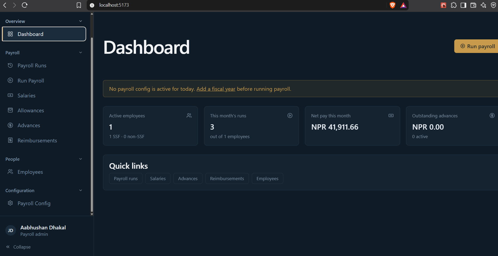
- Employees list + the add/edit drawer
  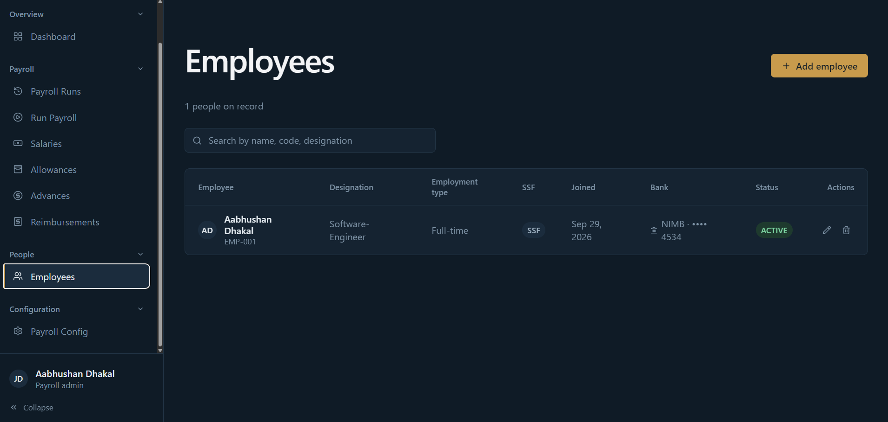
  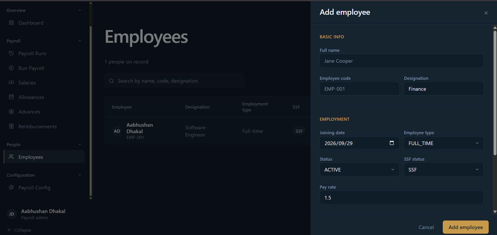
- Salaries — the dynamic allowance rows editor
  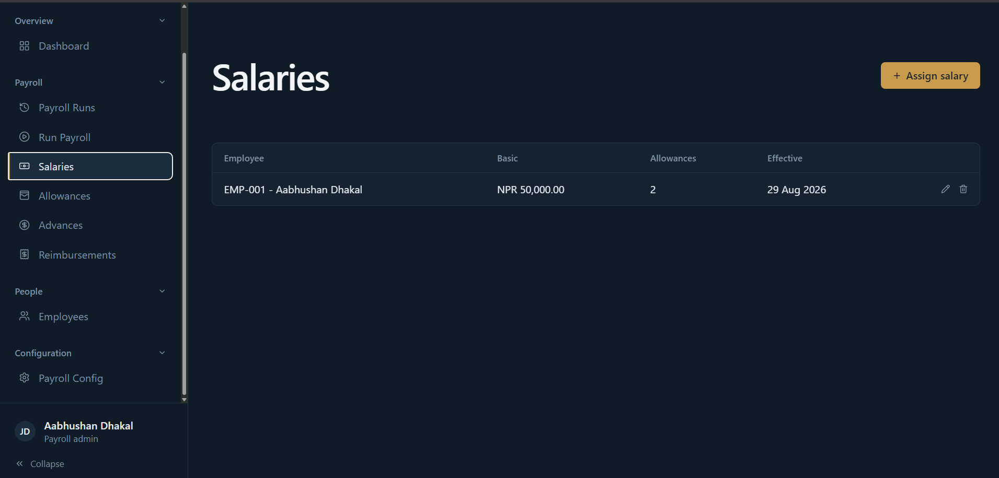
  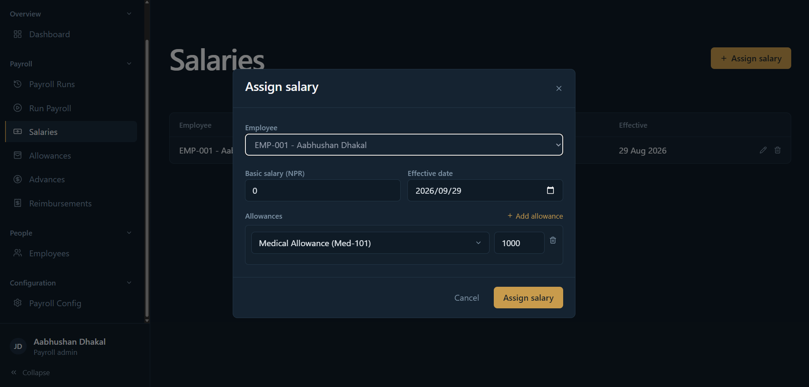
- Payroll Config — the tax slab editor
  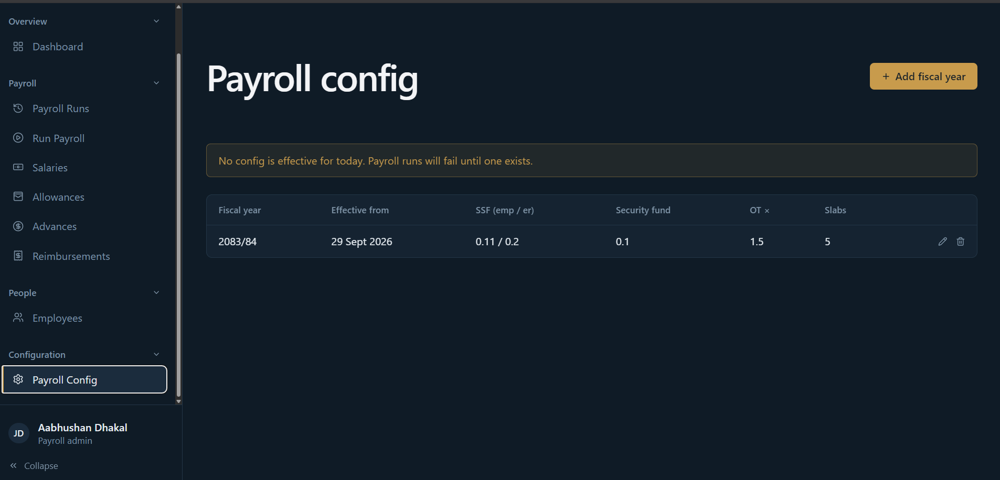
  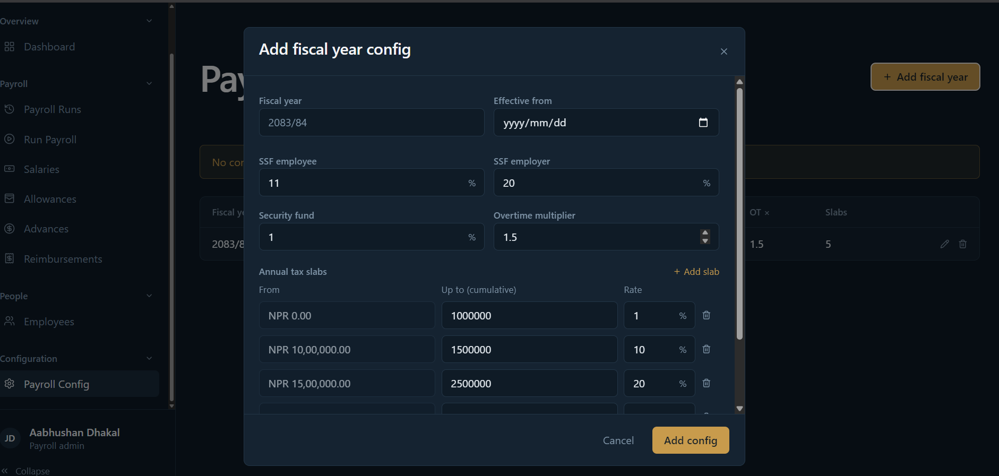
- Advances — the recovery progress bar and expanded deduction history
  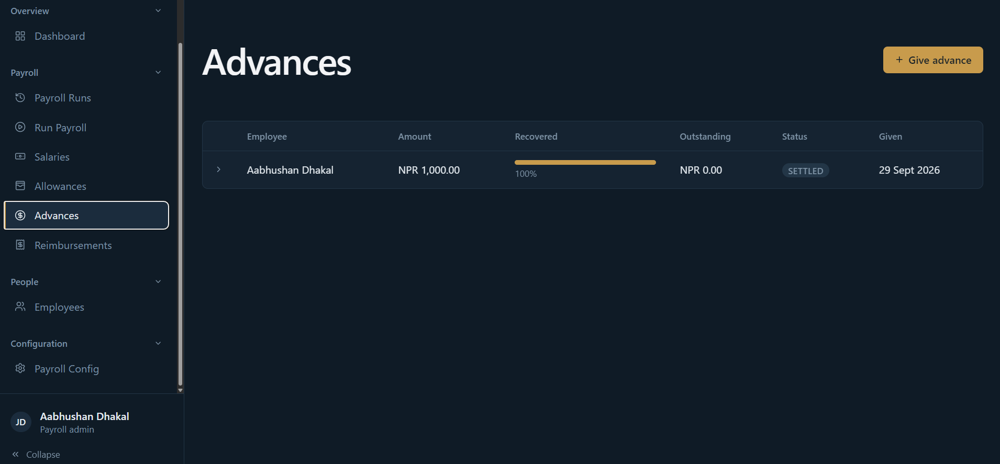
  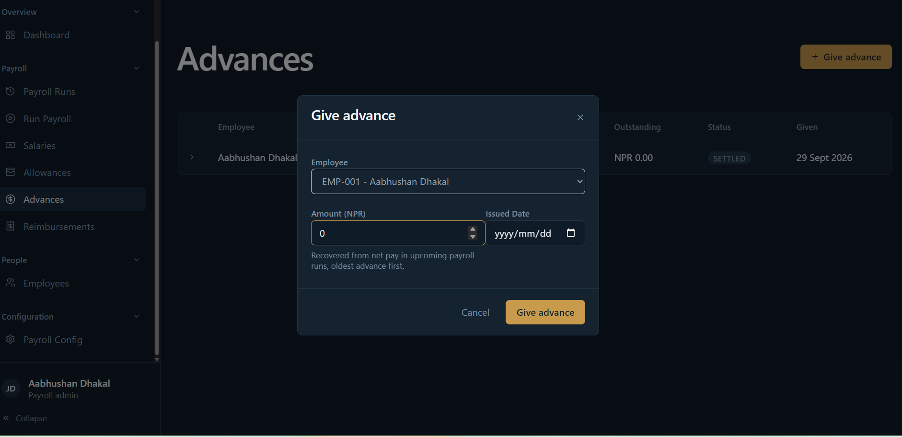
- Reimbursements — filtered by status
  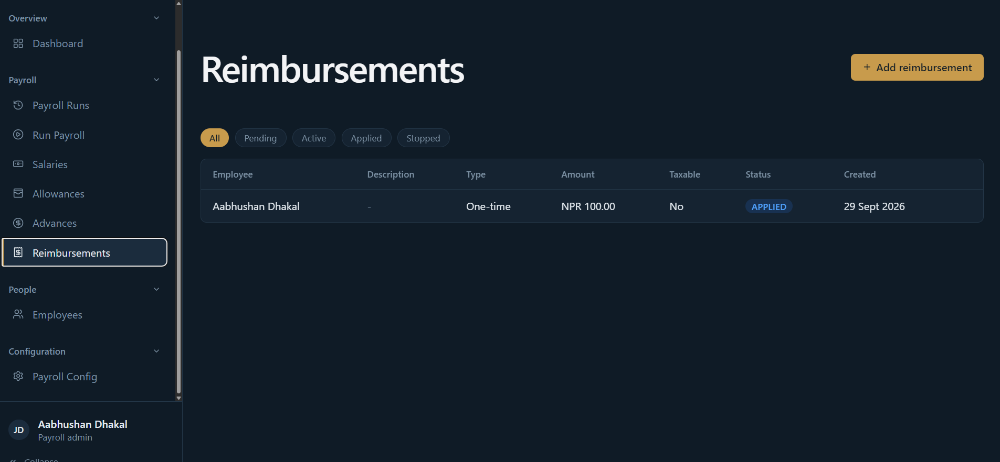
  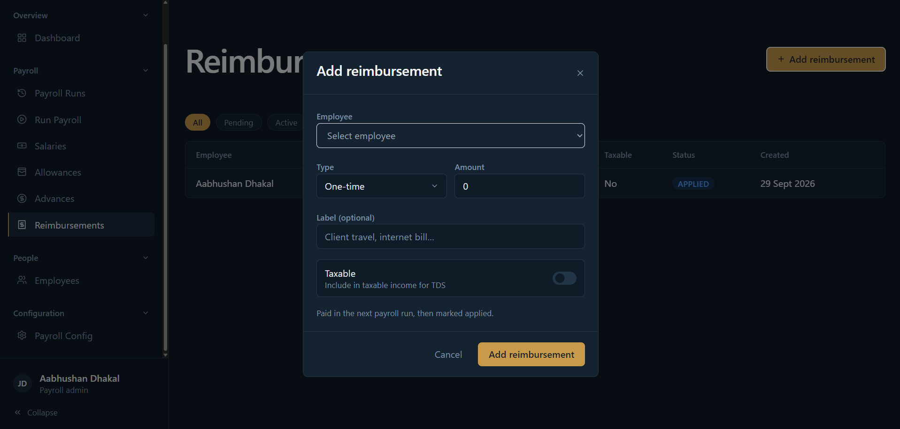
- Run Payroll — single run with the side context panel
  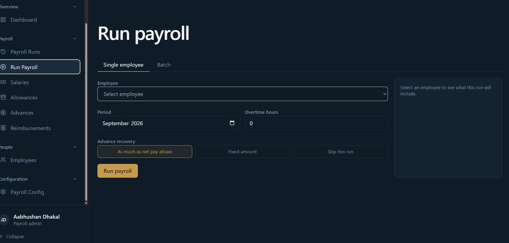
- Run Payroll — batch run result breakdown
  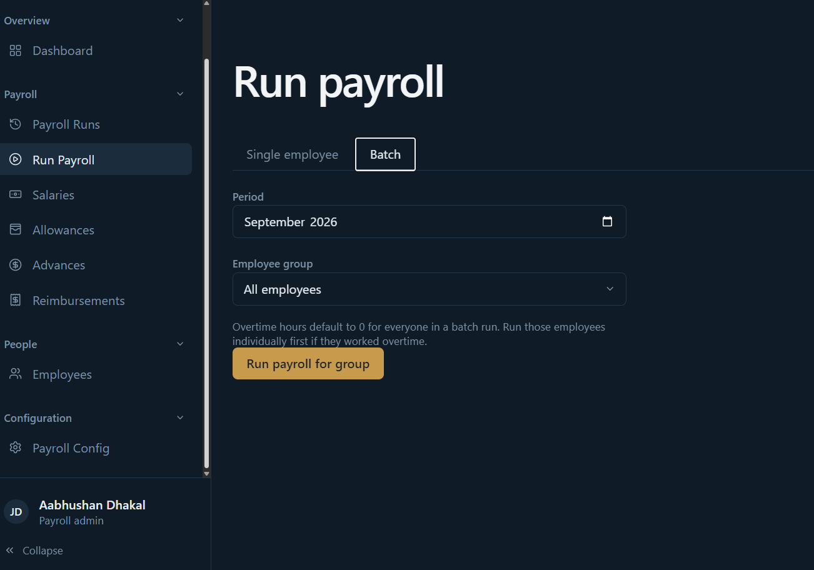
- Payroll run detail — employee figures vs. admin figures toggled on
  that negative salary are calculated because of bugs that is fixed
  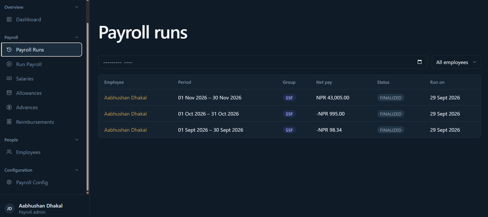
- The embedded payslip viewer, both employee and admin view
  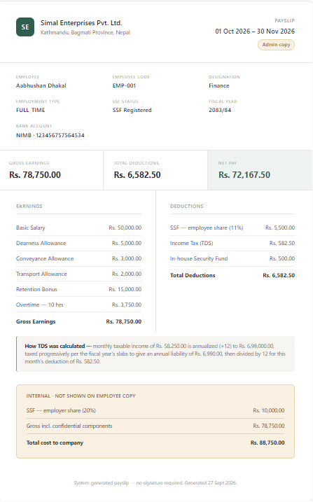
  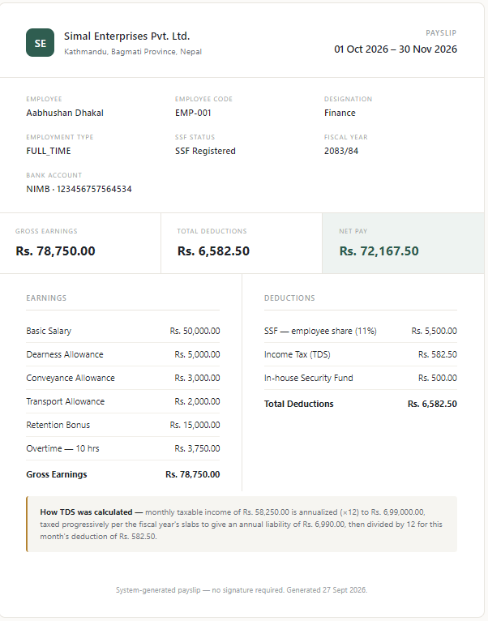
